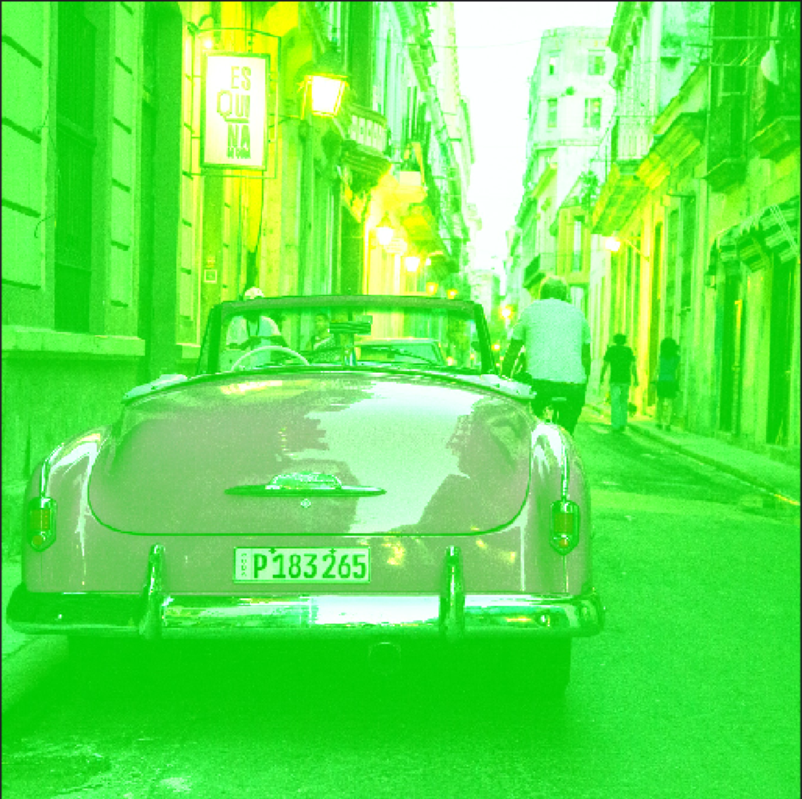

## Image Processor

In this project, we'll progress images using the following methods:

Multiply
Subtract
Multiply and Screen
Multiply and Subtract
Overlay
Add 200G to car.tga
Scale R * 4, B * 0
Write each RGB channel into a separate file [R,R,R] (each are b&w)
Combine 3 channel layer files (b&w) into one (colored)
Flip img upside down
Combine 4 imgs into one

We also test if the results from our images match the expected output.

```
make build
make test
make run

```
 

For instance, adding 200 to the value Green.

  =>  

Please note, the real photos used are in the examples and input folder.